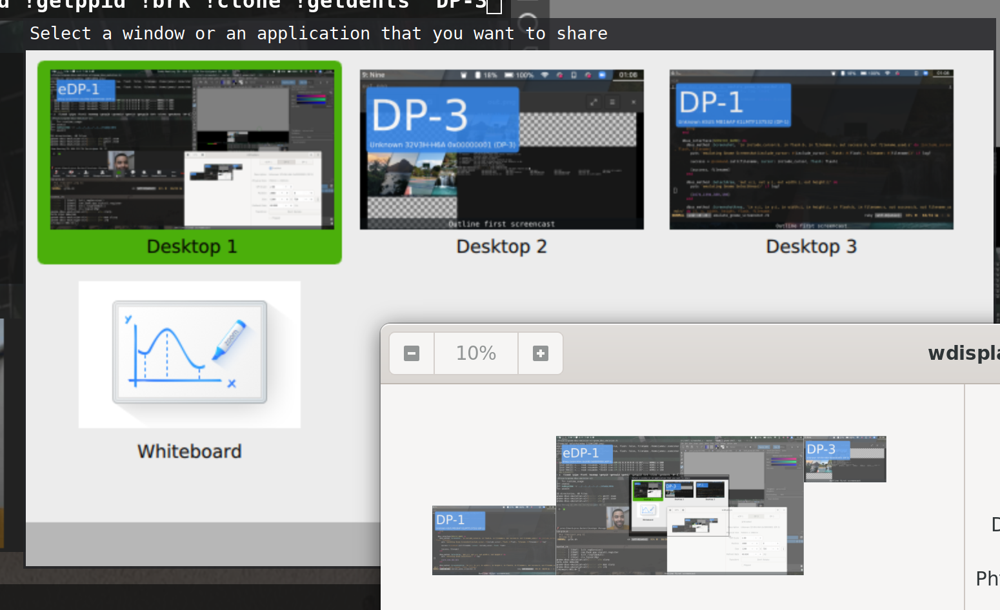

# Gnome DBus Emulation

Emulates `org.gnome.Shell.Screenshot` for other desktops.

Works by emulating Gnome's DBus interfaces and forwarding screenshot calls to [xdg-desktop-portal](https://github.com/flatpak/xdg-desktop-portal), which in turn forwards them to Wayland's [wlroots implementation](https://github.com/emersion/xdg-desktop-portal-wlr/).

Alternatively a custom screenshotting tool such as [grim](https://github.com/emersion/grim) can be used.

## Why

Some apps have screenshot functionality written exclusively for Gnome, and are missing cross desktop support.

Specifically, Zoom Screensharing on Wayland works this way. Using this tool
enables Zoom screensharing to work on any desktop with a screenshot command.

## Alternatives when using Zoom

Using this tool will produce high quality screenshots when called by zoom but
it does not do so regularly, resulting in a very low framerate.

Possible alternatives include:

- Using a hardware capture device to loop HDMI back in as a webcam, then using that from Zoom
- Using [wf-recorder](https://github.com/ammen99/wf-recorder#usage) with [v4l2loopback](https://github.com/umlaeute/v4l2loopback) to create a virtual webcam: instructions at [wf-recorder!43](https://github.com/ammen99/wf-recorder/pull/43#usage) or [r/swaywm](https://www.reddit.com/r/swaywm/comments/cfrnz1/has_anyone_managed_to_get_screen_sharing_on_zoom/eudoz27/). A [further workaround](https://www.reddit.com/r/swaywm/comments/di7ev1/screensharing_w_sway_possible/f3uc856/) to improve quality is to use [Zoom Chrome App](https://chrome.google.com/webstore/detail/zoom/hmbjbjdpkobdjplfobhljndfdfdipjhg) to share an ffplay window.
- Asking the Zoom developers to directly support [`xdg-desktop-portal`](https://flatpak.github.io/xdg-desktop-portal/portal-docs.html), ideally with the [ScreenCast](https://flatpak.github.io/xdg-desktop-portal/portal-docs.html#gdbus-org.freedesktop.portal.ScreenCast) portal.

## Installation

1. Check [prerequisites](#requirements).
2. Clone this repo
3. `bundle install`

## Usage

### DBus Emulation

- Run `./gnome_dbus_emulation.rb` to emulate via xdg-desktop-portal.
- Run `./gnome_dbus_emulation.rb ./grim.sh` to emulate via the grim screenshot tool.
- Run `./gnome_dbus_emulation.rb ./your-custom-script` for custom screenshotting. This will be called with `filename`, `showcursor` and `showflash` as arguments. See `grim.sh` for an example.

### Trigger gnome-screenshot

- Run `./gnome_screenshot.rb filename.png` to save a screenshot via the `org.gnome.Shell.Screenshot` DBus.
- Run `./gnome_screenshot.rb` to take and open a screenshot via the `org.gnome.Shell.Screenshot` DBus.

### Trigger xdg-desktop-portal screenshot

- Run `./portal_screenshot.rb filename.png` to save a screenshot via the `org.freedesktop.portal.Desktop` DBus.
- Run `./portal_screenshot.rb` to take and open a screenshot via the `org.freedesktop.portal.Desktop` DBus.

## Requirements

- Ruby
- DBus running in session mode, so `DBUS_SESSION_BUS_ADDRESS` is set. This can be started by systemd or by launching launching your window manager with `dbus-launch --exit-with-session sway -d`.
- [`grim`](https://github.com/emersion/grim) for screenshotting with `grim.sh`

### Zoom Requirements

- Zoom checks `XDG_CURRENT_DESKTOP` and `XDG_SESSION_TYPE`, so needs to be run with: `XDG_SESSION_TYPE=wayland XDG_CURRENT_DESKTOP=GNOME /opt/zoom/ZoomLauncher`
- May need to add `enableWaylandShare=true` to `~/.config/zoomus.conf` under `[General]` to bypass operating system detection.
- When using multiple screens they must be arranged horizontally to mimic gnome-screenshot. Consider using [WDisplays](https://github.com/cyclopsian/wdisplays) to re-arrange windows if Zoom is unable to identify the correct regions.

### Running with Portals

By default we emulate `org.gnome.Shell.Screenshot` by calling through to the `xdg-desktop-portal` DBus.

For that to work the following requirements must be met:

- Recent version of [`xdg-desktop-portal`](https://github.com/flatpak/xdg-desktop-portal), running with `path/to/xdg-desktop-portal -r` in the background.
- Recent version of [`xdg-desktop-portal-wlr`](https://github.com/emersion/xdg-desktop-portal-wlr/), running in the background.
